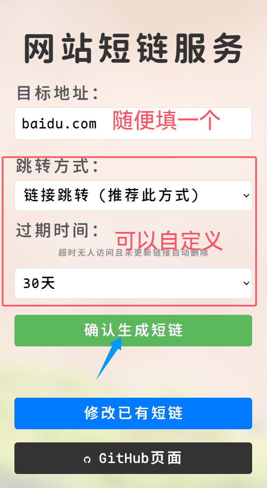
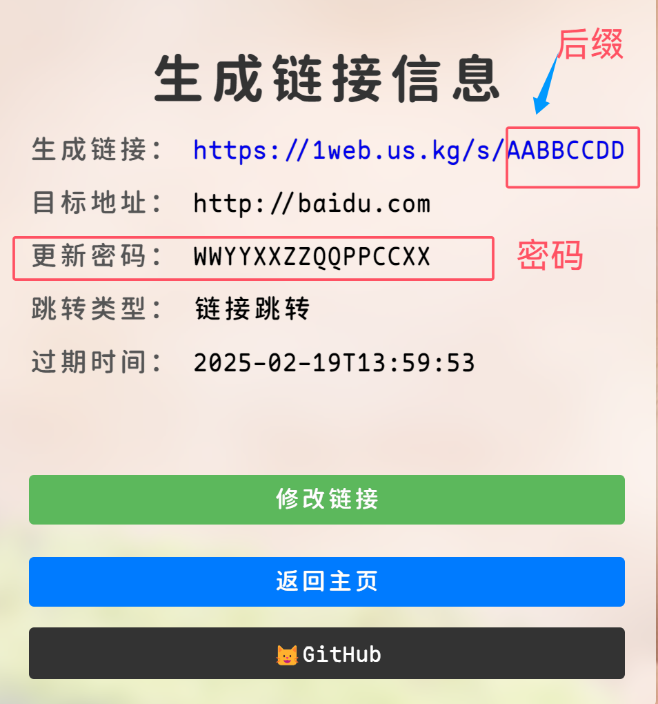
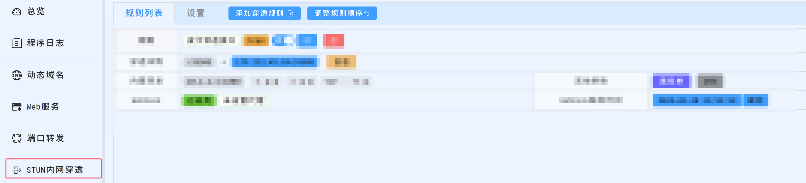
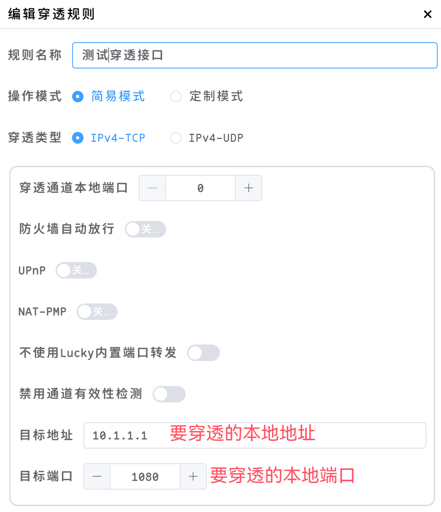
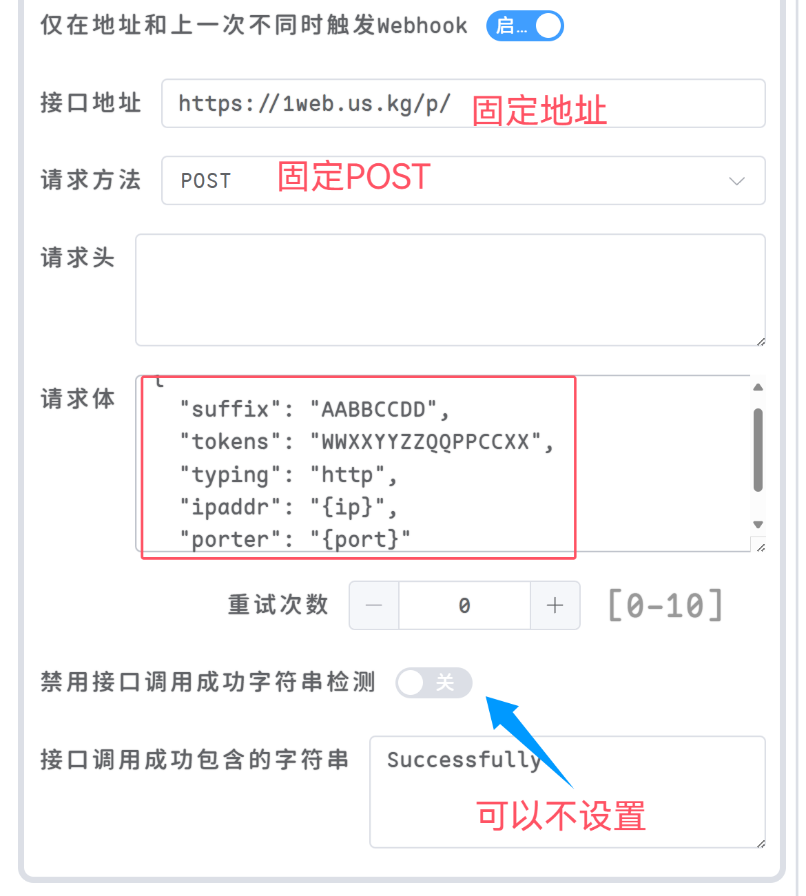

# 使用Lucky配合本工具进行NAT穿透

## 确认NAT类
打开：https://mao.fan/mynat

如果是NAT1，基本可以穿透

NAT4就不用尝试了，不行的

## 申请短URL
 - 申请地址：[https://524229.xyz/](https://524229.xyz/)



## 保存短URL
 - 链接`/s/`后面的`AABBCCDD`是suffix`网站后缀`
 - `更新密码`要保存好，只会显示一次，无法恢复



## 安装Lucky
安装教程：https://lucky666.cn/docs/install

## 打开Lucky


## 设置Lucky
设置本地地址端口：


设置云端更新地址：

 - 请求地址：`https://524229.xyz/p/`
 - 请求类型：POST
 - 请求体：
```json
{
  "suffix": "网站后缀",
  "tokens": "更新密码",
  "typing": "http",
  "ipaddr": "{ip}",
  "porter": "{port}"
}
```
协议可以自己选择`http`或者`https`
